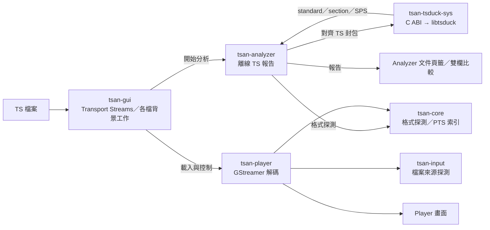
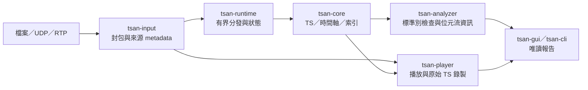

# TS Analyzer 架構

> 以目前 repository 程式碼為準；「規劃」不代表已可使用。

## 現有組件

| Crate | 目前功能 |
| --- | --- |
| `tsan-core` | 辨識 188／192／204-byte TS；以影片 PTS 與 packet offset 建立檔案時間軸／候選跳轉點，不依賴 PCR。 |
| `tsan-input` | 檔案來源的 TS 格式探測；尚未接收 UDP／RTP。 |
| `tsan-analyzer` | 離線掃描 TS：PAT／PMT、PID／節目與錯誤統計；從 AVC／HEVC SPS 取得解析度，從 TSDuck SPS／VUI 取得可用的幀率，無需播放。預設啟用原生 TSDuck 分析。 |
| `tsan-tsduck-sys` | 進程內 C++ bridge 與安全 Rust 包裝；opaque session、188-byte 封包對齊、TSDuck section／continuity／standard 統計及 SPS／VUI 解析。不呼叫 TSDuck CLI。 |
| `tsan-player` | Windows GStreamer 檔案播放、D3D12／D3D11 後端；已定義 File／UDP／RTP 來源與錄製選項，但 IP 接收及錄製尚未實作。跳轉仍有待修正。 |
| `tsan-gui` | 多檔 Transport Streams 清單、各檔獨立背景分析結果、只顯示已勾選檔案的比較頁籤、Analyzer 子頁、Player 與 Log。比較欄數會依視窗寬度調整；播放仍是單一 worker。 |
| `tsan-runtime`、`tsan-cli` | 仍為占位實作，未承擔正式資料調度或 CLI 分析。 |

## 現況資料流

  - 匯入後由 Rust 掃描封包，並經 C ABI 在同一程序呼叫 TSDuck；GStreamer 的解碼結果不是分析真值。Information 不等待播放。
  - 原生包裝器可接收任意切分的 188-byte buffer；目前檔案分析直接送入已對齊封包，GStreamer appsink 即時路徑尚未串接。
  - 匯入對話框可一次選多個檔案；分析最多兩個工作同時執行，其餘排隊，每個 TS 保留獨立結果。選擇 queue 或頁籤只切換分析視圖，從 queue 的「Play TS」才載入單一 Player。近期檔案記在使用者 AppData。IP Streaming 目前只有 UDP／RTP 入口，尚無接收後端。
  - Analyzer 已提供 Overview、PSI／SI、Packets、TR 101 290、Bitrate、PCR／PTS／DTS 與 random-access spacing。TR 101 290 使用 Family → System → Signalling → Delivery 四層 profile；產品範圍包含 DVB-T／T2／C Annex A、ATSC 1.0、J.83 Annex B／C、ISDB-T Japan／International 與 DTMB。ATSC PSIP、ARIB／ABNT SI 及 China DTV SI 規則由各自模組疊加在 MPEG-2 TS Priority 1／2 檢查上。
  - 目前 GUI 直接協調分析與播放，尚未透過 `tsan-runtime` 分派。
  - `tsan-recorder` 已移除。IP 串流及 TS 錄製屬於 `tsan-player` session；`tsan-input` 僅提供可重用的輸入／封包處理。

## 分析擴充方向（規劃）

  1. 經 TSDuck bridge 輸出完整 PSI／DVB SI／ATSC PSIP 表與 descriptor；以偵測到的廣播標準套用對應規則，不把 DVB 專用缺失套到 ATSC。
  2. TR 101 290 對所有 MPEG-2 TS profile 共用 Priority 1／2 checker；DVB 使用 Priority 3，ATSC Cable PSIP、ARIB、ABNT 與 China DTV SI 使用對應的 table PID、完整性與週期規則。純 TS 靜態分析只把 VCT 或 delivery descriptor 內容視為 signalled hint，不能把 RF modulation、FEC、MER 或 BER 標成已驗證。
  3. 擴充音訊／影片 metadata。H.264／H.265 SPS 解析度與 TSDuck 可提供的 SPS／VUI 幀率已接通；AAC、更多 parameter set 與無 VUI 時的幀率仍待完成。
  4. 擴充 packet offset 與 IDR／IRAP 索引；必要時以 PTS 或可驗證的 packet clock 回退。播放器使用索引定位，仍由 GStreamer 負責解碼與輸出。

## 串流與播放邊界（規劃）

  - `tsan-player` 接收 UDP／RTP、管理播放與原始 TS 錄製；錄製不得改寫 payload、PID、CC 或封包順序。
  - `tsan-runtime` 日後以有界佇列分發資料，明確記錄丟包與背壓；分析不應因 UI／播放器停頓而失去資料。
  - 快速跳轉只保留最新目標並忽略過期結果；本機 TS 的 byte-level 索引與 `appsrc` 供應屬後續優化，不能視為目前已解決的 seek。
  - TSDuck 是進程內原生相依套件，C++ exception 由 bridge 轉成錯誤碼；EasyICE、DVB Inspector、VLC 與 `GeminiAdvice.md` 僅作設計／驗證參考。TSDuck 採 BSD-2-Clause，發行時須附授權與對應平台的 DLL／so／dylib；目前尚未完成自帶 runtime 的發行包。
